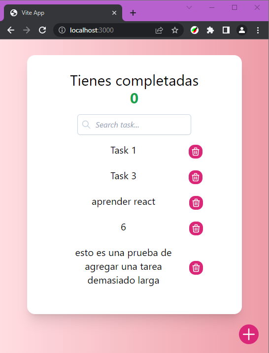

# To-list react for codo a codo 4.0

To-do list project created for "bootcamp" codo a codo 4.0

## Tools used

> pnpm - Package manager for Node.js

> vite - Vite is a static site generator for Node.js

> tailwindcss - CSS framework for the web

> eslint and prettier - Code style tools

> vite-plugin-gh-pages - for deployment to gh-pages

## Future changes in this project

> Re-Factor useTasks, split in agnostic hooks

> useContext (?).... I don't know if it's necessary

## image of the project

